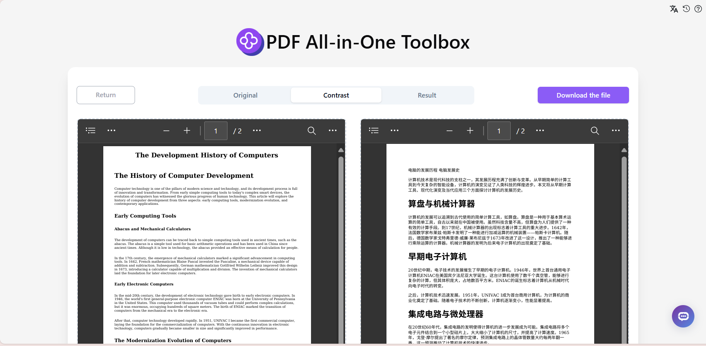

# 
 📠PDF All-in-One Toolbox 🚀✨

PDF All-in-One Toolbox allows users to process uploaded PDFs in various ways, including text extraction, full-text translation, summary generation, and conversion to common formats like HTML, Markdown, Docx, Jpeg, png. Additionally, it enables users to engage in conversations with AI language models using the PDF content as context, facilitating quick and deep understanding of document content.

<a href="README_zh.md">中文</a> | <a href="README.md">English</a> | <a href="README_ja.md">日本語</a>

This is the open-source version of the [PDF All-in-One Toolbox](https://302.ai/product/detail/25) from [302.AI](https://302.ai/en/). You can directly log in to 302.AI to use the online version with zero code and zero background, or modify and deploy it yourself according to your requirements.

## Interface Preview
After uploading a PDF file, you can choose from various processing options, including text extraction, translation, and summary generation.

Convert PDF files to various common formats such as HTML, Markdown, Docx, Jpeg, png, etc.
           

Engage in intelligent conversations with AI using the PDF content as context for quick document comprehension.
        

Support batch processing functionality to handle multiple PDF files simultaneously, improving work efficiency.
      

## Project Features
### 📝 Text Extraction and Processing
Support text extraction from PDFs with translation and summary generation capabilities.
### 🔄 Format Conversion
Convert PDFs to common formats like HTML, Markdown, Docx, Jpeg, png.
### 🤖 Intelligent Conversation
Engage in conversations with AI using PDF content as context for deep document understanding.
### 🌓 Dark Mode
Supports dark mode to protect your eyes.
### 🌍 Multi-language Support
- Chinese Interface
- English Interface
- Japanese Interface

## 🚩 Future Update Plans
- [ ] Add OCR functionality for scanned PDFs
- [ ] Add PDF editing features

## 🛠️ Tech Stack
- React
- Tailwind CSS
- Shadcn UI

## Development & Deployment
1. Clone the project `git clone https://github.com/302ai/302_pdf_all_in_one_toolbox`
2. Install dependencies `yarn`
3. Configure 302's API KEY (refer to .env.example)
4. Run the project `yarn dev`
5. Build and deploy `docker build -t pdf_all_in_one_toolbox . && docker run -p 3000:80 pdf_all_in_one_toolbox`
6. Node version 20 or above required

## ✨ About 302.AI ✨
[302.AI](https://302.ai/en/) is an enterprise-oriented AI application platform that offers pay-as-you-go services, ready-to-use solutions, and an open-source ecosystem.✨
1. 🧠 Comprehensive AI capabilities: Incorporates the latest in language, image, audio, and video models from leading AI brands.
2. 🚀 Advanced application development: We build genuine AI products, not just simple chatbots.
3. 💰 No monthly fees: All features are pay-per-use, fully accessible, ensuring low entry barriers with high potential.
4. 🛠 Powerful admin dashboard: Designed for teams and SMEs - managed by one, used by many.
5. 🔗 API access for all AI features: All tools are open-source and customizable (in progress).
6. 💡 Powerful development team: Launching 2-3 new applications weekly with daily product updates. Interested developers are welcome to contact us.
