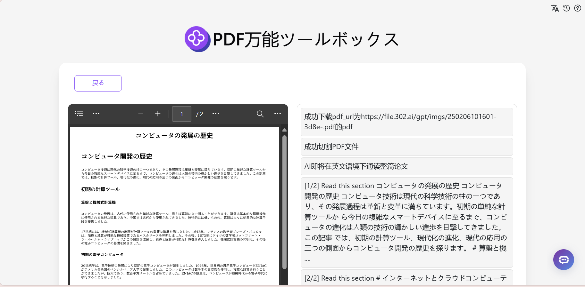

# 
 📝 PDF万能ツールボックス 🚀✨

PDF万能ツールボックスは、アップロードされたPDFファイルに対して、テキスト抽出、全文翻訳、要約生成などの様々な処理を行うことができます。また、HTML、Markdown、Docx、Jpeg、pngなどの一般的な形式への変換も可能です。さらに、PDFの内容をコンテキストとしてAI言語モデルと対話することで、文書の内容を素早く深く理解することができます。

<a href="README_zh.md">中文</a> | <a href="README.md">English</a> | <a href="README_ja.md">日本語</a>

[302.AI](https://302.ai/ja/)の[PDF万能ツールボックス](https://302.ai/product/detail/25)のオープンソース版です。
302.AIに直接ログインすることで、コード不要、設定不要のオンライン体験が可能です。
あるいは、このプロジェクトをニーズに合わせてカスタマイズし、302.AIのAPI KEYを統合して、自身でデプロイすることもできます。

## インターフェースプレビュー
PDFファイルをアップロードした後、テキスト抽出、翻訳、要約生成など、様々な処理方法を選択できます。

PDFファイルの内容から全文要約を生成します。
           

PDFファイルの内容を多言語に翻訳することができます。
        

AI対話機能を提供し、PDF内容に基づいてAIと深い対話を行い、文書のポイントを素早く理解することができます。
      

## プロジェクトの特徴
### 📝 テキスト抽出と処理
PDFからテキストを抽出し、翻訳や要約などの処理を行うことができます。
### 🔄 フォーマット変換
PDFをHTML、Markdown、Docx、Jpeg、pngなどの一般的な形式に変換できます。
### 🤖 インテリジェント対話
PDF内容をコンテキストとしてAIと対話し、ファイルの内容を深く理解することができます。
### 🌓 ダークモード
ダークモードをサポートしており、あなたの目を保護します。
### 🌍 多言語サポート
- 中国語インターフェース
- 英語インターフェース
- 日本語インターフェース

## 🚩 将来のアップデート計画
- [ ] OCR機能を追加し、スキャンされたPDFをサポート
- [ ] PDF編集機能を追加

## 🛠️ 技術スタック
- React
- Tailwind CSS
- Shadcn UI

## 開発とデプロイ
1. プロジェクトをクローン `git clone https://github.com/302ai/302_pdf_all_in_one_toolbox`
2. 依存関係をインストール `yarn`
3. 302のAPI KEYを設定（.env.exampleを参照）
4. プロジェクトを実行 `yarn dev`
5. ビルドとデプロイ `docker build -t pdf_all_in_one_toolbox . && docker run -p 3000:80 pdf_all_in_one_toolbox`
6. Node.jsバージョン20以上が必要

## ✨ 302.AIについて ✨
[302.AI](https://302.ai/ja/)は企業向けのAIアプリケーションプラットフォームであり、必要に応じて支払い、すぐに使用できるオープンソースのエコシステムです。✨
1. 🧠 包括的なAI機能：主要AIブランドの最新の言語、画像、音声、ビデオモデルを統合。
2. 🚀 高度なアプリケーション開発：単なるシンプルなチャットボットではなく、本格的なAI製品を構築。
3. 💰 月額料金なし：すべての機能が従量制で、完全にアクセス可能。低い参入障壁と高い可能性を確保。
4. 🛠 強力な管理ダッシュボード：チームやSME向けに設計 - 一人で管理し、多くの人が使用可能。
5. 🔗 すべてのAI機能へのAPIアクセス：すべてのツールはオープンソースでカスタマイズ可能（進行中）。
6. 💪 強力な開発チーム：大規模で高度なスキルを持つ開発者集団。毎週2-3の新しいアプリケーションをリリースし、毎日製品更新を行っています。才能ある開発者の参加を歓迎します。
