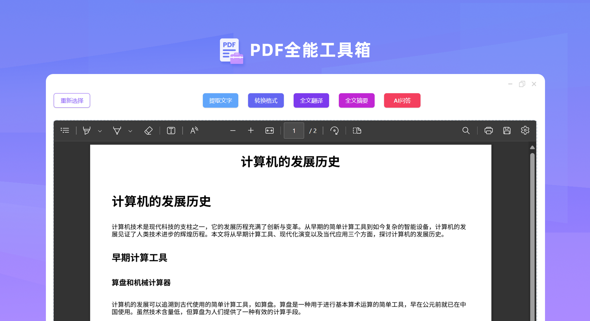
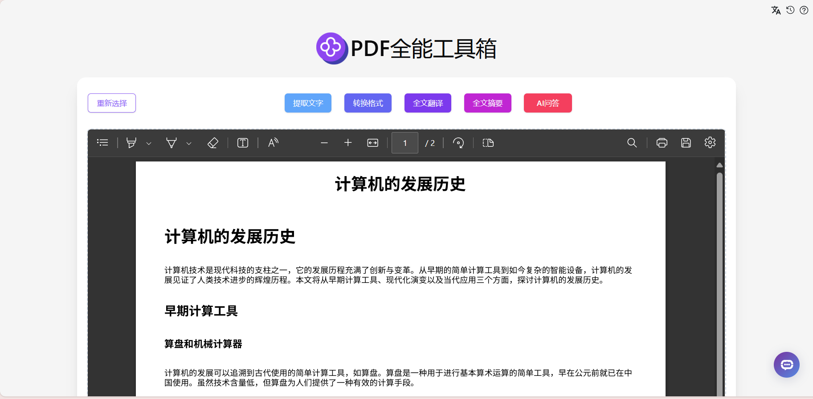
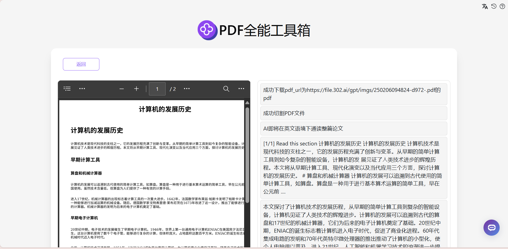
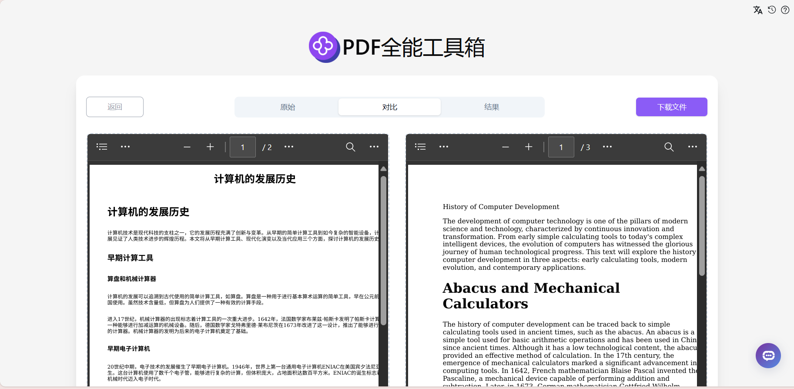
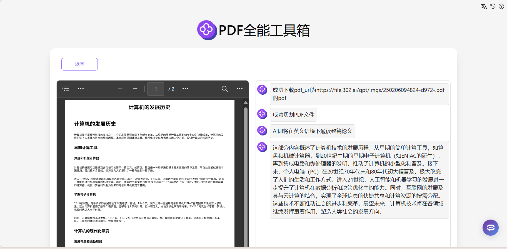

# 
 📝 PDF全能工具箱 🚀✨

PDF全能工具箱可将用户上传的PDF进行各种处理，包括提取文字、全文翻译、全文摘要等，还可以转换为HTML、Markdown、Docx、Jpeg、png等常见格式，除此之外还可以将文本内容作为上下文与AI大语言模型进行对话，快速深入了解文件内容。

<a href="README_zh.md">中文</a> | <a href="README.md">English</a> | <a href="README_ja.md">日本語</a>

来自[302.AI](https://302.ai)的[PDF全能工具箱](https://302.ai/product/detail/25)的开源版本。你可以直接登录302.AI，零代码零配置使用在线版本。或者对本项目根据自己的需求进行修改，传入302.AI的API KEY，自行部署。

## 界面预览
上传PDF文件后，可以选择多种处理方式，包括提取文字、翻译、生成摘要等。

根据PDF文件内容生成全文摘要。
           

支持多语言翻译PDF文件内容。
        

提供AI对话功能，可以基于PDF内容与AI进行深入交流，快速理解文档要点。
      

## 项目特性
### 📝 文本提取与处理
支持从PDF中提取文字内容，并进行翻译、摘要等处理。
### 🔄 格式转换
将PDF转换为HTML、Markdown、Docx、Jpeg、png等常见格式。
### 🤖 智能对话
可将PDF内容作为上下文与AI进行对话，深入理解文件内容。
### 🌓 暗色模式
支持暗色模式，保护您的眼睛。
### 🌍 多语言支持
  - 中文界面
  - English Interface
  - 日本語インターフェース

## 🚩 未来更新计划
- [ ] 增加OCR功能，支持扫描版PDF
- [ ] 添加PDF编辑功能

## 🛠️ 技术栈
- React
- Tailwind CSS
- Shadcn UI

## 开发&部署
1. 克隆项目 `git clone https://github.com/302ai/302_pdf_all_in_one_toolbox`
2. 安装依赖 `yarn`
3. 配置302的API KEY 参考.env.example
4. 运行项目 `yarn dev`
5. 打包部署 `docker build -t pdf_all_in_one_toolbox . && docker run -p 3000:80 pdf_all_in_one_toolbox`
6. node版本为20及以上

## ✨ 302.AI介绍 ✨
[302.AI](https://302.ai)是一个按需付费的AI应用平台，为用户解决AI用于实践的最后一公里问题。
1. 🧠 集合了最新最全的AI能力和品牌，包括但不限于语言模型、图像模型、声音模型、视频模型。
2. 🚀 在基础模型上进行深度应用开发，我们开发真正的AI产品，而不是简单的对话机器人
3. 💰 零月费，所有功能按需付费，全面开放，做到真正的门槛低，上限高。
4. 🛠 功能强大的管理后台，面向团队和中小企业，一人管理，多人使用。
5. 🔗 所有AI能力均提供API接入，所有工具开源可自行定制（进行中）。
6. 💡 强大的开发团队，每周推出2-3个新应用，产品每日更新。有兴趣加入的开发者也欢迎联系我们
